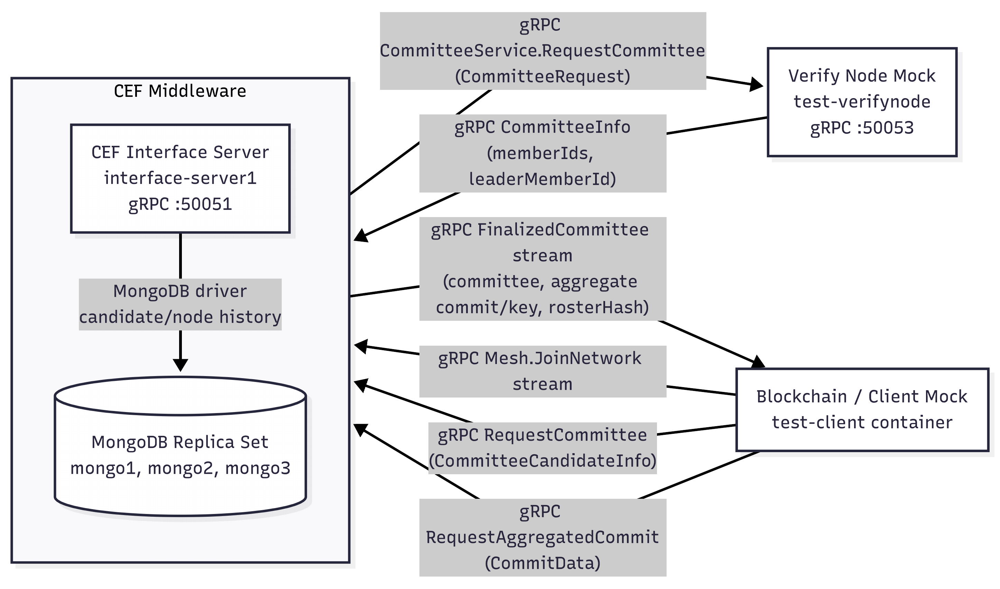

# Committee Election Framework (CEF)

## 프로젝트 개요

Committee Election Framework(CEF)는 블록체인 합의 과정에서 committee candidate 정보를 수집하고, 검증 노드(verify node)와 연동해 committee 선정을 중계하는 Go 기반 middleware입니다. 이 repository의 CEF는 gRPC interface server와 MongoDB replica set 저장 계층을 함께 사용해 동작합니다.

이 repository의 현재 구현은 client 또는 blockchain node가 보내는 후보 노드 정보, VRF seed/proof, Schnorr 기반 압축서명에 필요한 public key 및 commit 데이터를 protobuf/gRPC 인터페이스로 수신합니다. CEF는 수집한 후보 정보를 MongoDB에 저장하고, 검증 노드의 `CommitteeService.RequestCommittee` RPC로 전달한 뒤, 선정 결과를 `JoinNetwork` stream 구독자에게 `FinalizedCommittee` 메시지로 broadcast합니다.

통합 테스트 구성에서는 verify node 역할을 [IITP-TestProjects/test-verifynode](https://github.com/IITP-TestProjects/test-verifynode)에서 만들어지는 테스트용 mock container가 수행하고, blockchain node/client 역할을 [IITP-TestProjects/test-client](https://github.com/IITP-TestProjects/test-client)에서 만들어지는 테스트용 mock container가 수행합니다. 이 repository는 CEF middleware와 MongoDB replica set 구성을 담당하며, 두 mock node container 자체를 빌드하거나 포함하지는 않습니다.

압축서명 관련 코드는 `golang-x-crypto/ed25519/cosi`에 포함되어 있으며, 서버 구현에서는 committee의 public key와 commit을 집계해 `aggregatedPubKey`, `aggregatedCommit`, `rosterHash`를 생성하는 흐름을 사용합니다.

## 배경: IITP 블록체인 네트워크 기술개발 과제

이 repository는 IITP 과제 「노드 간 메시지 전달과 합의를 위한 최적 경로 네트워크 프로토콜 기술개발」의 일부 결과물입니다. 전체 과제는 블록체인 확장성 확보를 위해 O(N) 메시지 복잡도와 시간 제약 조건을 만족하는 분산 합의 기술, 블록 및 합의 메시지를 최소 시간 지연으로 전달하기 위한 하이브리드 P2P 네트워크 플랫폼, 커미티 기반 합의 구조의 관리 기술을 목표로 했습니다.

CEF는 전체 과제 중 계명대학교 수행 파트의 “블록 합의 네트워크 멤버십 관리 기법” 및 “네트워크 검증노드 연계 인터페이스 개발”과 관련된 middleware 구현입니다. 사업계획서에서는 커미티 멤버십 증명 정보가 커미티 참여 노드별로 생성 및 저장될 때 발생하는 증명 정보 크기와 전송 오버헤드를 줄이기 위해 멀티시그니처, 압축증명, Scalable 커미티 압축서명 방향을 제시합니다.

이 repository의 실제 구현은 해당 목표를 지원하기 위해 Schnorr 기반 collective/multi-signature 압축서명 기법을 사용합니다.

## CEF의 역할

CEF는 단순한 interface server가 아니라 blockchain node/client와 verify node 사이에 위치하는 middleware입니다. 통합 테스트에서는 blockchain node/client 쪽은 `IITP-TestProjects/test-client`, verify node 쪽은 `IITP-TestProjects/test-verifynode`에서 만든 mock container로 대체됩니다.

현재 코드 기준 주요 역할은 다음과 같습니다.

1. `Mesh.JoinNetwork` stream으로 client/blockchain node를 구독자로 등록합니다.
2. `Mesh.RequestCommittee`로 committee candidate 정보를 수신합니다.
3. candidate의 `round`, `nodeId`, `seed`, `proof`, `publicKey`, `commit`, `ipAddress`, `port`, `channel` 값을 내부 메모리에 모으고 MongoDB에 저장합니다.
4. 후보가 `threshold`에 도달하거나 timeout이 발생하면 verify node의 `CommitteeService.RequestCommittee`로 candidate 목록을 전달합니다.
5. verify node가 반환한 `memberIds`, `leaderMemberId` 기준으로 committee member를 확정합니다.
6. 선정된 member의 public key와 commit을 `cosi.NewCosigners`, `AggregatePublicKey`, `AggregateCommit`으로 집계합니다.
7. committee public key 목록을 정렬해 SHA-256 기반 `rosterHash`를 계산합니다.
8. `FinalizedCommittee`를 `JoinNetwork` 구독자에게 broadcast합니다.
9. 선정된 committee 크기만큼 `Mesh.RequestAggregatedCommit` 메시지를 받은 뒤, round별 `aggregatedCommit`을 다시 broadcast합니다.

현재 CEF server의 gRPC 구현은 commit 수집 및 aggregate commit 생성까지 담당합니다. `interface.proto`의 `CommitData`는 `round`와 `commit` 필드만 포함하고, `network.go`의 `RequestAggregatedCommit`은 이 값을 `cosi.Commitment`로 모아 `AggregateCommit`을 호출합니다. partial signature(`cosi.SignaturePart`) 생성, 수집, `AggregateSignature` 호출은 `golang-x-crypto/ed25519/cosi` primitive와 테스트 코드에는 존재하지만 현재 CEF server RPC surface에는 별도 message/RPC로 연결되어 있지 않습니다.

## 시스템 아키텍처



CEF는 `CEF Interface Server`와 `MongoDB Replica Set`을 함께 사용하는 middleware로 보는 것이 맞습니다. MongoDB는 verify node 하위 구성요소가 아니라 CEF가 candidate/node history를 저장하기 위해 사용하는 내부 저장 계층입니다.

`docker-compose.yml`에는 verify node mock container와 client mock container가 포함되어 있지 않습니다. CEF와 verify node는 `-verifynode=verify-server1:50053` 같은 gRPC endpoint 설정을 통해 데이터를 교환합니다. Docker network는 테스트용 mock container들이 서로의 container DNS name을 찾기 위한 실행 환경 구성일 뿐, CEF와 verify node 관계를 설명하는 논리적 아키텍처 경계는 아닙니다.

테스트용 mock container의 출처는 다음과 같습니다.

- Verify node mock: [IITP-TestProjects/test-verifynode](https://github.com/IITP-TestProjects/test-verifynode)
- Blockchain node/client mock: [IITP-TestProjects/test-client](https://github.com/IITP-TestProjects/test-client)

## Repository 구조

```text
.
├── main.go                         # CEF gRPC server entrypoint
├── network.go                      # Mesh service RPC 구현
├── network_helper.go               # committee 후보 수집, verify node 요청, 집계 로직
├── network_verify.go               # verify node gRPC client 초기화
├── tool.go                         # MongoDB 연결, 저장 helper, threshold 설정
├── interface.proto                 # client/blockchain node <-> CEF gRPC interface
├── verify.proto                    # CEF <-> verify node gRPC interface
├── test.proto                      # 초기/테스트용 proto 정의
├── proto_interface/                # interface.proto에서 생성된 Go 코드
├── proto_verify/                   # verify.proto에서 생성된 Go 코드
├── golang-x-crypto/ed25519/cosi/   # Schnorr/Ed25519 기반 collective signature 구현
├── Dockerfile                      # CEF server image build
├── docker-compose.yml              # CEF + MongoDB replica set container 구성
├── mongoKeySetup.sh                # MongoDB replica set keyfile 생성
├── interfaceDockerBuild.sh         # bcinterface Docker image build helper
├── go.mod
└── go.sum
```

## 주요 컴포넌트

### gRPC/protobuf interface

`interface.proto`의 `mesh.Mesh` service는 blockchain node/client가 CEF에 접근하는 인터페이스입니다. 통합 테스트에서는 [IITP-TestProjects/test-client](https://github.com/IITP-TestProjects/test-client)에서 만들어지는 client mock container가 이 역할을 수행합니다.

- `JoinNetwork(CommitteeCandidateInfo) returns (stream FinalizedCommittee)`: committee 결과를 받기 위한 streaming subscribe입니다.
- `LeaveNetwork(NodeAccount) returns (Ack)`: graceful shutdown용 RPC입니다.
- `RequestCommittee(CommitteeCandidateInfo) returns (Ack)`: committee candidate 등록 요청입니다.
- `RequestAggregatedCommit(CommitData) returns (Ack)`: committee 선정 이후 round별 commitment 집계 요청입니다. 현재 `CommitData`는 partial signature가 아니라 `bytes commit`을 전달합니다.

`verify.proto`의 `committee.CommitteeService` service는 CEF가 verify node에 committee 선정을 요청할 때 사용합니다. 통합 테스트에서는 [IITP-TestProjects/test-verifynode](https://github.com/IITP-TestProjects/test-verifynode)에서 만들어지는 verify node mock container가 이 역할을 수행합니다.

- `RequestCommittee(CommitteeRequest) returns (CommitteeInfo)`
- `CommitteeRequest`: `CommitteeCandidates` 목록과 `channel` 포함
- `CommitteeInfo`: `channel_id`, `member_ids`, `leader_member_id`, `timestamp` 포함

### CEF interface server

`main.go`는 `-verifynode` flag로 verify node 주소를 받습니다. 값이 없으면 서버를 시작하지 않습니다.

```bash
server -verifynode=verify-server1:50053
```

서버는 `:50051`에서 gRPC listener를 열고 `Mesh` service를 등록합니다.

### Committee candidate 수집 및 선정

`network_helper.go`의 `appendCandidate`는 round별 candidate를 메모리에 저장합니다. 현재 threshold는 `tool.go`의 상수로 정의되어 있습니다.

```go
const (
    threshold     = 10
    gcRoundWindow = 4
)
```

round별 candidate가 10개 이상 모이면 committee 선정이 시작됩니다. candidate가 threshold에 도달하지 않아도 `maxWait = 10 * time.Second` timeout이 발생하면 `finalizeCommitteeSelection`이 실행됩니다.

### Schnorr 기반 compressed signature 지원

`golang-x-crypto/ed25519/cosi`는 Ed25519 curve 기반 collective signature 구현을 포함합니다. 코드 주석과 구현상 commit은 Schnorr commit으로 설명되며, `Commit`, `Cosign`, `AggregatePublicKey`, `AggregateCommit`, `AggregateSignature`, `Verify`, `VerifyPart` primitive를 제공합니다.

개념적으로 CEF는 blockchain node가 gRPC로 전달하는 public key와 서명 관련 데이터를 모아 압축/집계 결과를 broadcast하는 middleware입니다. 다만 현재 public RPC 구현에서 직접 수집하는 서명 관련 값은 partial signature share가 아니라 Schnorr signing commitment입니다. 일반적인 collective signing 흐름에서 partial signature share는 aggregate commit 이후 생성되는 다음 단계 데이터입니다.

CEF 서버의 현재 gRPC 흐름에서는 다음 데이터를 사용합니다.

- candidate가 보낸 `publicKey`
- candidate가 보낸 `commit`
- 선정된 committee member의 `aggregatedPubKey`
- 선정된 committee member의 `aggregatedCommit`
- 정렬된 public key 목록 기반 `rosterHash`

현재 서버 코드에서 직접 호출되는 집계 함수는 `AggregatePublicKey`와 `AggregateCommit`입니다. partial signature에 해당하는 `SignaturePart`와 최종 collective signature 생성을 위한 `AggregateSignature`는 `cosi` 패키지에 구현되어 있지만, 현재 `Mesh` service에는 signature part 수집용 RPC가 별도로 정의되어 있지 않습니다.

### Verify node 연동

`network_verify.go`는 `grpc.NewClient`와 insecure transport credential로 verify node에 연결합니다. CEF는 연결 상태가 `READY`가 될 때까지 최대 5초 대기하고, 준비되지 않으면 종료합니다. 테스트 환경에서 verify node는 `IITP-TestProjects/test-verifynode`에서 만들어지는 mock container로 구성합니다.

Docker Compose 기준 verify node 주소는 다음과 같습니다.

```yaml
command: ["-verifynode=verify-server1:50053"]
```

테스트 container 환경에서 `-verifynode=verify-server1:50053` 값을 그대로 사용하려면 `verify-server1`이라는 container DNS name이 해석 가능해야 합니다. 실제 데이터 교환은 `50053` 포트의 `committee.CommitteeService` gRPC service를 통해 수행됩니다.

### Blockchain node/client mock 연동

CEF repository에는 blockchain node/client container가 포함되어 있지 않습니다. 통합 테스트에서는 `IITP-TestProjects/test-client`에서 만들어지는 mock container가 CEF의 `mesh.Mesh` gRPC service를 호출하는 client 역할을 수행합니다.

client mock은 CEF server의 `50051` 포트로 접속해 다음 RPC를 호출하는 쪽입니다.

- `JoinNetwork`: committee 결과 stream 수신
- `RequestCommittee`: round별 committee candidate 등록
- `RequestAggregatedCommit`: committee 선정 이후 commitment 집계 요청

테스트 container 간 통신으로 실행하는 경우 client mock container가 CEF의 gRPC endpoint를 해석할 수 있어야 합니다. 이 repository의 compose 설정에서는 보통 같은 테스트용 Docker network에 붙여 `interface-server1:50051`로 접근합니다.

### MongoDB 저장 로직

`tool.go`의 `initMongo`는 다음 replica set URI에 접속합니다.

```text
mongodb://mongo1:27017, mongodb://mongo2:27018, mongodb://mongo3:27019
replica set: rs0
username/password: root/root
```

현재 후보 노드 정보 저장은 `insertNodeInfo`를 통해 수행되며 저장 대상은 다음과 같습니다.

```text
database: committee_service
collection: node_history
```

`insertCommitteeInfo` helper는 `committee_service.committee_history`에 저장하도록 정의되어 있지만, 현재 `finalizeCommitteeSelection` 흐름에서는 호출되지 않습니다. 또한 `activeIndex`, `findNodeInfo`, `deleteNodeInfo`에는 `node_info.committee_history`를 사용하는 코드가 남아 있습니다.

## 데이터 흐름

1. CEF server가 `-verifynode` 주소로 verify node에 gRPC client connection을 생성합니다. 통합 테스트에서는 `IITP-TestProjects/test-verifynode`에서 만든 verify node mock container가 이 대상입니다.
2. CEF server가 `:50051`에서 `mesh.Mesh` gRPC server를 시작합니다.
3. blockchain node/client가 `JoinNetwork` stream에 접속해 `FinalizedCommittee` 수신 채널을 엽니다. 통합 테스트에서는 `IITP-TestProjects/test-client`에서 만든 client mock container가 이 역할을 수행합니다.
4. blockchain node/client들이 `RequestCommittee`로 round별 candidate 정보를 보냅니다.
5. CEF는 candidate 정보를 round별 메모리 map에 누적합니다.
6. candidate가 `threshold = 10`에 도달하거나 10초 timeout이 발생하면 CEF가 candidate 정보를 MongoDB에 저장합니다.
7. CEF가 `verify.proto`의 `CommitteeRequest`로 verify node mock에 committee 선정을 요청합니다.
8. verify node mock이 `CommitteeInfo`로 member ID 목록과 leader ID를 반환합니다.
9. CEF는 선정된 member만 남긴 뒤 public key와 commit을 집계하고 `rosterHash`를 계산합니다.
10. CEF가 `FinalizedCommittee`를 모든 `JoinNetwork` 구독자에게 broadcast합니다.
11. 선정된 committee 크기만큼 `RequestAggregatedCommit`이 들어오면 CEF가 round별 `aggregatedCommit`을 생성해 다시 broadcast합니다.

## 실행 환경

- Docker
- Docker Compose
- OpenSSL: `mongoKeySetup.sh`에서 `openssl rand` 사용
- MongoDB shell: `docker-compose.yml`의 MongoDB image가 `mongo:4.4.6`이므로 container 내부 기본 shell은 `mongo`입니다.
- Go: `go.mod` 기준 `go 1.24.0`, Dockerfile 기본 build arg는 `GO_VER=1.25`입니다.
- gRPC/protobuf Go runtime: `google.golang.org/grpc`, `google.golang.org/protobuf`
- MongoDB Go driver: `go.mongodb.org/mongo-driver`

일반 실행은 Docker image build와 Docker Compose를 기준으로 합니다. proto 파일을 다시 생성해야 하는 개발 작업에서는 별도의 `protoc` 및 Go protobuf plugin이 필요할 수 있지만, 현재 repository에는 생성된 `proto_interface`, `proto_verify` Go 코드가 포함되어 있습니다.

## 실행 방법

### 1. MongoDB Key File 생성

CEF는 MongoDB container 3개를 replica set으로 사용합니다. replica set key file을 먼저 생성해야 합니다.

```bash
./mongoKeySetup.sh
```

macOS에서는 `sudo`를 붙이지 말고 바로 실행합니다. 실행이 끝나면 repository root에 `rs_keyfile`이 생성되고 권한은 `0400`으로 설정됩니다.

### 2. Interface Server Docker Image Build

다음 명령으로 CEF interface server Docker image를 빌드합니다.

```bash
./interfaceDockerBuild.sh 0.1
```

`0.1`은 image tag 버전입니다. 다른 값을 사용해도 되지만, 이 경우 `docker-compose.yml`의 `bc1.image` 값도 같은 tag로 맞춰야 합니다.

```yaml
bc1:
  image: bcinterface:0.1
```

### 3. Container 실행

```bash
docker compose up -d
```

현재 `docker-compose.yml`은 테스트 container 연동을 위해 `test-verifier_bc_interface`라는 external Docker network를 사용합니다. 해당 network가 없는 환경에서는 `docker compose up -d`가 실패할 수 있습니다. 테스트용 verify node mock과 client mock을 container로 함께 실행할 경우 network 이름을 맞추거나 다음처럼 network를 먼저 생성합니다.

```bash
docker network create test-verifier_bc_interface
```

통합 테스트를 container 기반으로 실행할 때는 다음 endpoint들이 서로 접근 가능해야 합니다.

- CEF middleware: 이 repository의 `bc1` service, container name `interface-server1`
- Verify node mock: `IITP-TestProjects/test-verifynode`에서 만들어지는 container, CEF 설정 기준 gRPC endpoint `verify-server1:50053`
- Blockchain node/client mock: `IITP-TestProjects/test-client`에서 만들어지는 container, CEF gRPC endpoint `interface-server1:50051` 또는 host 환경에서는 `localhost:50051` 사용

### 4. MongoDB Replica Set 초기화

container가 생성되면 `mongo1` container에 접속합니다.

```bash
docker exec -it mongo1 /bin/bash
```

MongoDB shell에 접속합니다. 이 repository의 compose 설정은 `mongo:4.4.6` image를 사용하므로 기본 명령은 `mongo`입니다.

```bash
mongo -u root -p root
```

만약 로컬에서 더 최신 MongoDB image로 바꿔 실행한다면 `mongosh -u root -p root`가 필요할 수 있습니다.

다음 명령으로 `mongo1`, `mongo2`, `mongo3`를 `rs0` replica set으로 묶습니다.

```javascript
rs.initiate({
  _id: "rs0",
  version: 1,
  members: [
    { _id: 0, host: "mongo1:27017" },
    { _id: 1, host: "mongo2:27018" },
    { _id: 2, host: "mongo3:27019" }
  ]
})
```

### 5. Replica Set 상태 확인

```javascript
rs.status()
```

`rs0:PRIMARY>` prompt가 표시되는 node에서 write 작업이 가능합니다. `rs0:SECONDARY>` prompt에서는 기본적으로 read가 막힐 수 있습니다.

## 설정 정보

| 항목 | 값 |
| --- | --- |
| CEF Docker service | `bc1` |
| CEF container name | `interface-server1` |
| CEF image | `bcinterface:0.1` |
| CEF gRPC port | `50051` |
| Verify node address | `-verifynode=verify-server1:50053` |
| Verify node mock repository | [`IITP-TestProjects/test-verifynode`](https://github.com/IITP-TestProjects/test-verifynode) |
| Blockchain/client mock repository | [`IITP-TestProjects/test-client`](https://github.com/IITP-TestProjects/test-client) |
| Test Docker network | `test-verifier_bc_interface` external network |
| MongoDB services | `mongo1`, `mongo2`, `mongo3` |
| MongoDB image | `mongo:4.4.6` |
| MongoDB ports | `27017`, `27018`, `27019` |
| MongoDB replica set | `rs0` |
| MongoDB root user/password | `root` / `root` |
| Compose init DB env | `MONGO_INITDB_DATABASE=peer_information` |
| Application insert DB/collection | `committee_service.node_history` |
| Committee history helper target | `committee_service.committee_history` |
| Legacy index/find/delete target in code | `node_info.committee_history` |
| MongoDB key file mount | `./rs_keyfile:/etc/mongodb/pki/keyfile` |

## 유용한 MongoDB 명령어

```javascript
// 모든 DB 조회
show dbs

// 특정 DB 사용
use <DBname>

// 현재 DB의 collection 조회
show collections

// 특정 collection 내부 데이터 조회
db.<collection>.find().pretty()

// 특정 collection 내부 모든 데이터 삭제, Primary node에서만 가능
db.<collection>.deleteMany({})
```

Secondary node에서 조회 시 다음과 같은 오류가 발생할 수 있습니다.

```text
"errmsg" : "not master and slaveOk=false"
```

이 경우 MongoDB shell에서 다음 명령을 실행하면 Secondary node에서도 read가 가능합니다.

```javascript
rs.secondaryOk()
```

MongoDB 접속 시 port를 지정하려면 다음 형식을 사용합니다.

```bash
mongo --port 27018 -u root -p root
```

## Troubleshooting

### MongoDB replica set이 초기화되지 않은 경우

CEF의 `initMongo`는 `rs0` replica set 상태 조회까지 수행합니다. `rs.initiate(...)`를 하지 않았거나 replica set이 정상 상태가 아니면 CEF container가 MongoDB 연결 또는 `replSetGetStatus` 단계에서 실패할 수 있습니다.

확인 순서:

```bash
docker exec -it mongo1 /bin/bash
mongo -u root -p root
```

```javascript
rs.status()
```

### `rs_keyfile` 권한 문제

MongoDB replica set key file은 권한이 너무 열려 있으면 container가 시작되지 않을 수 있습니다. `mongoKeySetup.sh`는 다음 작업을 수행합니다.

```bash
openssl rand -base64 756 > ./rs_keyfile
chmod 0400 ${PWD}/rs_keyfile
```

macOS에서는 `sudo` 없이 실행하는 것을 권장합니다.

### Docker image tag mismatch

`./interfaceDockerBuild.sh 0.1`로 빌드했다면 `docker-compose.yml`의 `bc1.image`도 `bcinterface:0.1`이어야 합니다. tag가 다르면 Compose가 없는 image를 찾거나 다른 버전의 image를 실행할 수 있습니다.

### Docker network 문제

현재 Compose 설정은 테스트 container 연동을 위해 external network를 사용합니다.

```yaml
networks:
  test-verifier_bc_interface:
    external: true
```

해당 network가 없으면 `docker compose up -d`가 실패합니다. 이는 테스트 container들이 container DNS name으로 서로를 찾기 위한 실행 환경 문제입니다. 실제 아키텍처상 CEF와 verify node는 Docker network 자체가 아니라 gRPC endpoint로 통신하므로, container 기반 테스트가 아니라면 `-verifynode` 값을 실제 접근 가능한 host/port로 설정하면 됩니다.

### Verify node 연결 실패

`main.go`는 `-verifynode` 값이 없으면 서버를 시작하지 않습니다. 또한 `network_verify.go`는 verify node connection이 5초 안에 `READY`가 되지 않으면 종료합니다.

확인할 값:

- `docker-compose.yml`의 `bc1.command`
- `IITP-TestProjects/test-verifynode`에서 만든 verify node mock container 이름 또는 DNS 이름
- verify node mock의 gRPC port가 `50053`인지 여부
- `bc1.command`의 `-verifynode` 값이 CEF container에서 접근 가능한 gRPC endpoint인지 여부
- container 기반 테스트에서 `verify-server1` 이름으로 verify node mock을 찾을 수 없다면 `bc1.command`의 `-verifynode` 값을 실제 container/service 이름 또는 접근 가능한 host/port에 맞게 수정했는지 여부

### CEF server가 MongoDB에 연결하지 못하는 경우

CEF Interface Server는 CEF 내부 저장 계층인 MongoDB replica set에 container DNS 이름 `mongo1`, `mongo2`, `mongo3`와 port `27017`, `27018`, `27019`로 접속합니다. MongoDB container들이 CEF compose 환경에서 접근 가능해야 하며, `rs0` replica set 초기화가 끝나야 합니다.

### gRPC connection 실패

CEF의 client-facing gRPC server는 host port `50051`에 노출됩니다.

```yaml
ports:
  - 50051:50051
```

host에서 client를 실행하는 경우 `localhost:50051`로 접근할 수 있습니다. 테스트용 client container에서 접근하는 경우에는 해당 container가 해석할 수 있는 CEF gRPC endpoint, 예를 들어 `interface-server1:50051`, 를 사용해야 합니다.

통합 테스트에서 `IITP-TestProjects/test-client`로 만든 client mock container가 CEF에 접속하지 못한다면 다음을 확인합니다.

- client mock container가 CEF의 gRPC endpoint에 접근할 수 있는지 여부
- client mock이 바라보는 CEF 주소가 container 내부 DNS 기준으로 `interface-server1:50051` 또는 해당 compose service name/port와 일치하는지 여부
- host에서 실행하는 client라면 `localhost:50051`을 사용하고 있는지 여부
